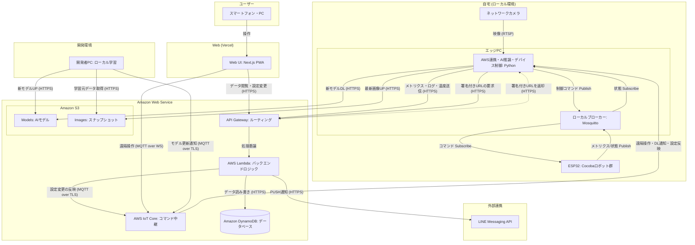

# Cocoba(ここば): 老犬を守る自律型排泄物シールドロボット

## プロジェクト概要
**Cocoba (ここば)** は、14歳の老犬「ここちゃん」が留守中に排泄物を踏み散らかしてしまう問題を解決するための、AI搭載型・自律移動ロボットです。
プロジェクト名は、**「ここちゃん (Coco)」** と **「ルンバ (Roomba)」** を掛け合わせて名付けました。

### 背景と目的
ここちゃんにとって、新しいトイレトレーニングは困難です。飼い主が不在の際、排泄物を踏んで床全体が汚れてしまう事故が発生しており、帰宅後の清掃負担と愛ここちゃんへの衛生面での懸念が課題となっていました。

Cocobaは、AIによる排泄検知、おやつによるここちゃんの誘導、そして物理的なドーム（シールド）による排泄物の隔離を自動で行うことで、「踏み散らかし事故をゼロ」にし、飼い主の負担を劇的に削減することを目指しています。

---

## 解決アプローチ

1.  **AI検知:**
    ネットワークカメラの映像から「ここちゃん」「排泄ポーズ」「排泄物」をリアルタイムでAIが識別。排泄場所を特定します。
2.  **誘引・退避:**
    排泄直後、おやつシューターを稼働させてここちゃんを安全な領域へ誘導。ロボットとの接触リスクを最小化します。
3.  **隔離・シールド:**
    自律移動ロボットが排泄箇所へ移動し、物理的なドームを投下して「覆う」ことで、ここちゃんの踏み散らかしを防止します

---

## 技術スタック

### 構成図


### 1. エッジ・推論レイヤー (Intel N100 / Python)
*   **役割:** YOLOv8を用いた物体検知、ロボットへの座標計算・移動指示。
*   **技術:** Python 3.11+, ONNX Runtime (INT8量子化), OpenCV, MQTT。
*   **熱対策:** N100のサーマルスロットリングを防ぐため、OpenVINOによる最適化とCPU負荷の徹底抑制。

### 2. フィジカル・制御レイヤー (ESP32 / C++)
*   **役割:** モーターの精密駆動、おやつ排出機構の制御、センサー監視、フェイルセーフ。
*   **技術:** C++17 (PlatformIO/Arduino), FreeRTOS (デュアルコア活用), MQTT
*   **安全性:** ネットワーク切断時や障害物接近時の自動停止機能を搭載。

### 3. クラウド・監視レイヤー (Next.js / AWS Lambda)
*   **役割:** 外出先からのステータス確認、検知時のスナップショット閲覧、緊急停止（キルスイッチ）。
*   **技術:** Vercel (Next.js 14), AWS Lambda (Python), Amazon API Gateway, Amazon DynamoDB, AWS IoT Core (MQTT), LINE Messaging API。
*   **特性:** サーバーレス構成による低コスト運用と、MQTT over WebSocket による低レイテンシな緊急停止コマンドの送信。

---

## ディレクトリ構成

```text
├── .claude/               # [AI] スキル・ログ・設定値の格納
├── .github/               # [CI/CD] GitHub Actionsのワークフロー定義
├── data/                  # [学習] YOLO追加学習用の生画像・アノテーションデータ
├── docs/                  # [仕様書] 要件・設計・ルール
├── hardware/              # [物理] 3Dモデル(.stl), 回路図, 部品表(BOM)
├── infrastructure/        # [基盤] API Gatewayの定義、Mosquitto設定、IaC(AWS SAM等)、docker
├── models/                # [推論] 学習済みAIモデル群 (.pt, .onnx, OpenVINO IR等)
├── scripts/               # [構築] 汎用スクリプト群 (ISSUE追加、セットアップ)
├── src/                   # [実装] システムソースコード群
│   ├── edge/              # ├── エッジPCのロジック
│   │   ├── inference/     # │   ├─ AI推論、カメラ映像処理 (YOLO / OpenCV)
│   │   ├── control/       # │   ├─ 内部のMQTTパブリッシュ/サブスクライブ処理
│   │   └── bridge/        # │   └─ AWS IoT CoreおよびS3との通信・URL要求
│   ├── firmware/          # ├── ESP32ハードウェア制御 (C++/PlatformIO)
│   ├── functions/         # ├── DB操作、外部連携 (Lambda/Python)
│   └── frontend/          # └── 遠隔監視UI (Next.js)
│   └── training/          # └── ローカル学習パイプライン
├── .gitignore             # [Git] データセットやコンパイル成果物等の除外設定
├── CLAUDE.md              # [AI] AIエージェント起動シーケンス
└── README.md              # [説明] プロジェクトの説明とセットアップ手順
```

---

## 安全性への最優先事項
*   **近接停止 (Proximity Stop):** ロボット稼働中にここちゃんが1.0m以内に接近した場合、1秒以内に強制停止。
*   **遠隔キルスイッチ:** WebUIから瞬時にロボットの全機能を停止可能。
*   **フェイルセーフ:** 通信断絶時にはモーター出力を自動的にゼロにします。