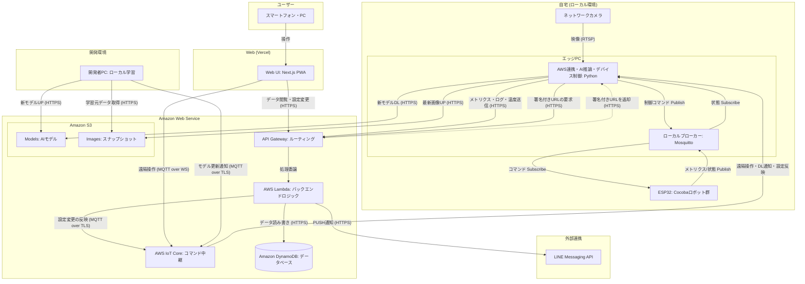
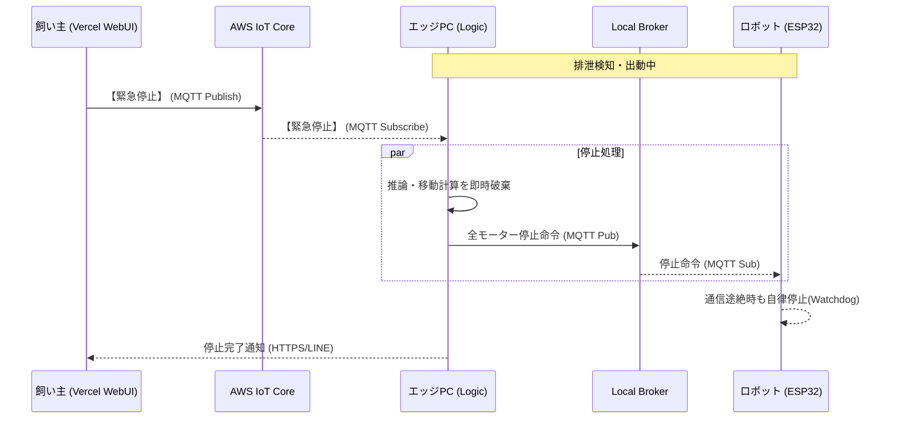

# 02_ARCHITECTURE（システムアーキテクチャ設計）

## 1. 基本方針：エッジ自律と低レイテンシの担保
本システムは、14歳のシニア犬（ここちゃん）の安全を最優先するため、以下の設計思想を貫く。

*   **エッジ自律稼働 (Local-First):** インターネット接続が途絶した場合でも、エッジPC内の「Local Broker」とデバイス間の通信のみで「検知〜誘導〜投下」のコア機能を完結させる。
*   **低レイテンシ推論:** カメラ映像のAI推論を現場（エッジPC）で完結させ、通信遅延による接触事故を構造的に排除する。
*   **サーバーレス・外部プラットフォーム活用:** クラウド側は運用負荷を最小化するため、AWS LambdaとVercelを組み合わせたハイブリッド構成を採用する。

---

## 2. 技術スタック選定

| レイヤー | コンポーネント | 技術・サービス | 選定理由 |
| :--- | :--- | :--- | :--- |
| **ローカル** | ロジック・推論 | Python 3.11, YOLOv8n,  OpenCV,  ONNX Runtime | AWS連携・AI推論・デバイス制御を統合管理 |
|  | デバイス制御中継 | Eclipse Mosquitto | クラウド遮断時もデバイス制御を継続するためのローカルブローカー |
|  | 制御マイコン | ESP32 (C++17, PlatformIO) | デュアルコアによる通信と制御の完全分離(FreeRTOS) |
| | 学習プロセス | Python 3.11, YOLOv8, OpenCV | ローカルのリソースを用いたモデル学習 |
| **クラウド** | API エントリ | Amazon API Gateway | セキュアなエンドポイント提供とLambdaへのルーティング |
| | バックエンド | AWS Lambda (Python) | イベント駆動による低コストかつスケーラブルな環境 |
| | メッセージ基盤 | AWS IoT Core (MQTT) | 遠隔操作・DL通知・設定反映の中継点 |
| | データベース | Amazon DynamoDB | 軽量かつ高速なサーバーレス・ドキュメントDB |
| | ストレージ | Amazon S3 | スナップショット（Images）とAIモデル（Models）の管理 |
| | 遠隔監視UI | Vercel (Next.js 14) | 高速なデプロイとNext.js(App Router)の配信 |

---

## 3. システムアーキテクチャ

### 3-1. 構成図

---

### 3.2. シーケンスの例 (緊急停止)
緊急停止（キルスイッチ）が他の通信に依存せず、最優先で処理される流れ。

---

## 4. セキュリティ設計

### 4.1. 認証と認可 (Identity & Access Management)
*   **デバイス認証 (X.509 証明書):** エッジPCは、個別の X.509 証明書を用いて AWS IoT Core へ接続する。これにより、デバイスのなりすましを物理的に防止する。
*   **ユーザー認証 (Amazon Cognito):** 飼い主のログイン管理には Cognito User Pools を使用し、多要素認証 (MFA) の導入を可能にする。
*   **リソース認可 (Cognito Identity Pools):** ログインしたユーザーに対し、IAM ロールを介して「特定の IoT トピックへの Publish」や「API Gateway へのアクセス」を一時的に許可する（最小権限の原則）。

### 4.2. データ保護とバイナリ通信 (Data Security)
*   **S3 署名付きURL (Presigned URL):** 
    *   **アップロード:** エッジPCが画像をアップロードする際、Lambda が発行した「5分間有効な書き込み専用URL」を使用する。S3 バケットを公開設定にする必要はない。
    *   **ダウンロード:** AIモデルやスナップショットの取得も同様に、有効期限付きの読み取り専用URLを介して行い、資産の漏洩を防止する。
*   **保存データの暗号化 (At Rest):** DynamoDB のログデータおよび S3 上のファイルは、AWS KMS (Key Management Service) を用いて常に暗号化された状態で保管する。

### 4.3. 通信の安全性 (Transit Security)
*   **常時 TLS 1.2+:** エッジ、クラウド、WebUI 間のすべての通信（HTTPS, MQTT over TLS, MQTT over WS）は TLS 1.2 以上で暗号化される。
*   **API Gateway 認可:** すべての API エンドポイントには `Cognito Authorizer` を設定し、正当なトークンを持つリクエスト以外を遮断する。
*   **ローカル MQTT 制限:** エッジ内の Mosquitto は外部ネットワークからのアクセスを遮断し、エッジPC内部および特定のローカルIP（ESP32）からのみ接続を許可する。

### 4.4. キルスイッチと可用性の担保
*   **QoS 1 (At Least Once):** 緊急停止信号は、AWS IoT Core および Local Broker において QoS 1 を使用し、パケットロス発生時も確実に再送・到達させる。
*   **LWT (Last Will and Testament):** エッジPCが通信断絶（Wi-Fi落ち等）した場合、AWS IoT Core が即座に「オフライン状態」を検知し、WebUIに警告を表示する（遺言メッセージ機能）。

### 4.5. 認証情報の管理
*   **環境変数の活用:** Vercel や Lambda における API キーやエンドポイント情報は、コード内にハードコードせず、各プラットフォームの環境変数（Secrets）として管理する。
*   **IAM ロール:** Lambda 関数には、DynamoDB や S3 へのアクセスに必要な最小限の権限のみを持つ IAM ロールを付与する。

---

## 5. ネットワーク構成まとめ

| 経路 | プロトコル | 用途 | 備考 |
| :--- | :--- | :--- | :--- |
| **カメラ → エッジPC** | RTSP | 視覚入力 | ローカル内で完結。クラウドへ動画は送らない。 |
| **Logic ⇔ Local Broker** | MQTT (TCP) | 内部中継 | エッジPC内でのプロセス間通信。 |
| **Local Broker ⇔ ESP32** | MQTT (TCP) | デバイス制御 | 自宅Wi-Fi内での低遅延制御。 |
| **Vercel ⇔ IoT Core** | MQTT over WS | **緊急停止** | ブラウザから双方向・即時通信を実現。 |
| **IoT Core → Logic** | MQTT over TLS | 遠隔介入 | 証明書認証による安全なNAT越えとクラウド連携。 |
| **Logic → API Gateway** | HTTPS | 状態同期 | 検知画像やログの永続化、通知用。 |
| **Vercel → API Gateway** | HTTPS | データ閲覧 | DynamoDBからの履歴取得。 |
| **Dev PC ⇔ S3** | HTTPS | 学習プロセス | 画像データの取得と学習済みモデルの配布。 |
