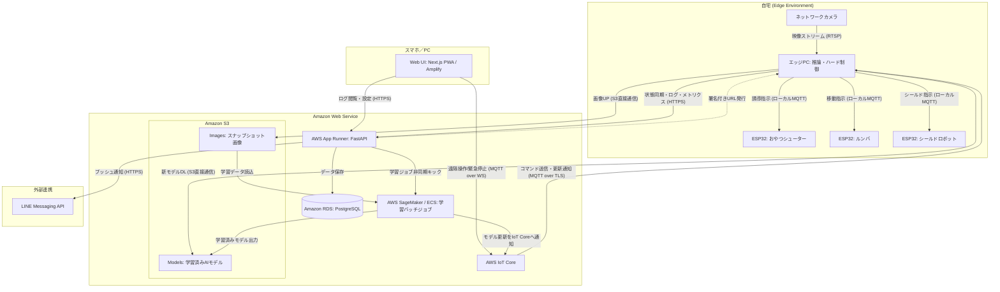
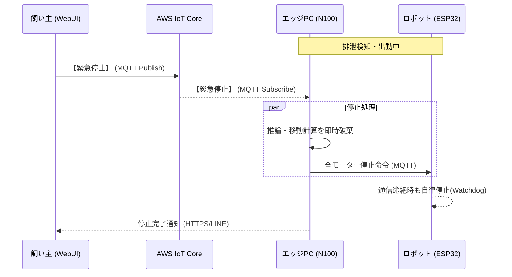

# 02_ARCHITECTURE（システムアーキテクチャ設計）

## 1. 基本方針：エッジ自律と低レイテンシの担保
本システムは、14歳のシニア犬（ここちゃん）の安全を最優先するため、以下の設計思想を貫く。

*   **エッジ自律稼働 (Local-First):** インターネット接続が途絶した場合でも、エッジPCとデバイス間の通信のみで「検知〜誘導〜投下」のコア機能を完結させる。
*   **低レイテンシ推論:** カメラ映像のAI推論を現場（エッジPC）で完結させ、通信遅延による接触事故を構造的に排除する。
*   **フルマネージド・クラウド:** クラウド側は運用負荷を下げるため、AWSのサーバーレス/マネージドサービスを積極的に採用する。

---

## 2. 技術スタック選定まとめ

| レイヤー | コンポーネント | 技術・サービス | 選定理由 |
| :--- | :--- | :--- | :--- |
| **Edge AI** | 推論エンジン | Python 3.11, YOLOv8n, ONNX Runtime | N100でのCPU負荷抑制と、高い検知精度の両立 |
| **Physical** | 制御マイコン | ESP32 (C++17, Arduino FW) | デュアルコアによる通信と制御の完全分離(FreeRTOS) |
| **Backend** | APIサーバー | **AWS App Runner** (FastAPI) | コンテナの運用負荷を最小化し、高速なAPIを提供 |
| | メッセージ基盤 | **AWS IoT Core** (MQTT) | 数千万デバイスを支える高信頼な双方向通信基盤 |
| | データベース | **Amazon RDS (PostgreSQL)** | 構造化データとログの確実な永続化（SQLiteは不採用） |
| | ストレージ | **Amazon S3 (Grouped)** | 画像資産（Images）とAIモデル（Models）の統合管理 |
| **Training** | 学習プロセス | **AWS Lambda / SageMaker** | LambdaによるトリガーとSageMakerによる重学習の分離 |
| **Frontend** | 遠隔監視UI | **AWS Amplify** (Next.js 14) | Next.jsの最新機能(App Router)と高速配信の両立 |

---

## 3. システムアーキテクチャ図

### 3.1. 全体システム構成図

※遠隔操作コマンド：緊急停止（キルスイッチ）、手動介入など

---

### 3.2. クリティカル・シーケンス (検知〜緊急停止)
緊急停止（キルスイッチ）が他の通信に依存せず、最優先で処理される流れです。

---

## 4. セキュリティ設計

### 4.1. デバイス認証と認可
*   **X.509 証明書認証:** エッジPCは AWS IoT Core に個別の証明書を用いて接続し、不正なデバイスのなりすましを防止する。
*   **Cognito 連携:** WebUI（飼い主）の認証は Amazon Cognito を使用し、正当な権限を持つユーザーのみが緊急停止を実行できる。

### 4.2. キルスイッチの堅牢性
*   **QoS 1 (少なくとも1回配信):** 緊急停止信号は AWS IoT Core の QoS 1 を使用し、パケットロスによる「止まらない」リスクを最小化する。
*   **LWT (遺言機能):** エッジPCが通信断絶（Wi-Fi落ち等）した場合、AWS IoT Core が即座に「オフライン状態」を検知し、WebUIに警告を表示する。

### 4.3. データベースおよびストレージの安全性
*   **RDS VPC配置:** データベースはプライベートサブネットに配置し、インターネットからの直接アクセスを遮断。App Runner からのみアクセスを許可する。
*   **S3 署名付きURL:** エッジPCからの画像アップロードやモデルダウンロードには、App Runnerが発行する一時的な署名付きURLを使用し、バケット自体の公開を防止する。

---

## 5. ネットワーク構成まとめ

| 経路 | プロトコル | 用途 | 備考 |
| :--- | :--- | :--- | :--- |
| **カメラ → エッジPC** | RTSP | 視覚入力 | ローカル内で完結。クラウドへ動画は送らない。 |
| **エッジPC ⇔ ESP32** | MQTT (Local) | デバイス制御 | 100ms以下の超低遅延制御。 |
| **WebUI ⇔ IoT Core** | MQTT over WS | **緊急停止** | ブラウザから双方向・即時通信を実現。 |
| **エッジ ⇔ IoT Core** | MQTT over TLS | 遠隔介入 | 証明書認証による安全なNAT越え。 |
| **エッジ → App Runner** | HTTPS | 状態同期 | 検知画像やログの永続化用。 |
| **WebUI → App Runner** | HTTPS | データ閲覧 | 過去ログや統計データの取得。 |
| **SageMaker ⇔ S3** | AWS SDK | 再学習 | 画像の読込およびモデルファイルの書出。 |
