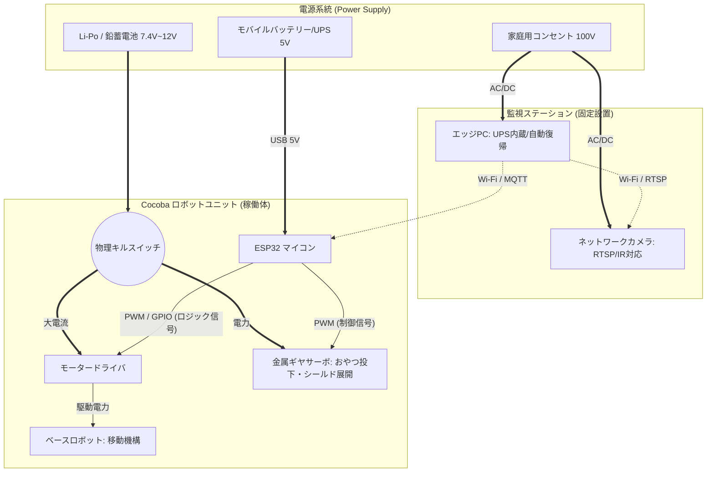

# 02_HARDWARE_ARCHITECTURE（ハードウェアアーキテクチャ設計）

## 1. ハードウェア基本方針：分離と物理的フェイルセーフ

ソフトウェアという「論理が100%支配する世界」から、物理法則、摩擦、熱が支配する「現実世界」への移行において、**「14歳のシニア犬（ココちゃん）の物理的な安全」**を最優先事項とし、以下の設計思想を貫く。

* **電源の完全分離 (Isolation):** マイコン（ESP32）の論理系電源と、モーター（車輪・シューター）の動力系電源は物理的に分離するか、強力な降圧モジュールで保護する。モーター始動時の電圧降下（Brownout）によるESP32の再起動（突然死）を防ぐための絶対原則とする。
* **物理的なキルスイッチ (Hardware Kill Switch):** WebUIからのソフトウェア停止に加え、ロボット本体に「人間が足で踏んで即座に全電源を遮断できる物理的な非常停止ボタン」を必ず搭載する。
* **シニア犬保護設計 (Dog-Proof):** ケーブル類はすべてスパイラルチューブやエンクロージャー（筐体）に格納し、噛みちぎりによる感電・誤飲リスクをゼロにする。稼働部のトルクは最小限に絞り、万が一接触しても怪我をしない限界値を設定する。

---

## 2. ハードウェア・ブロック図（物理結線図）

物理デバイス間の「電力」と「信号」の流れを示す。

---

## 3. ハードウェア構成（コンポーネント要件）

### 3.1. エッジ・デバイス（頭脳）
システムの頭脳であり、単一障害点となる最重要コンポーネント。常時稼働とAI推論の負荷に耐えうる堅牢性が求められる。
* **処理能力:** CPUのみで軽量オブジェクト検出モデル（YOLOv8nクラス）を最低10FPS以上で推論できるプロセッサ性能（Intel N100）。
* **メモリ:** 16GB RAM
* **ネットワーク:** 安定したローカルWi-Fi接続
* **電源・排熱管理:** 24時間365日の連続稼働を前提とした排熱機構。停電や瞬断に備え、内蔵バッテリー（UPS相当）を持つ端末、または電源断からの自動復帰機能（Auto Power On）を持つ端末

### 3.2. 視覚センサー・モジュール（目）
部屋の座標を把握するためのカメラ。解像度よりも、遅延の少なさと死角の排除を優先する。
* **通信規格:** ローカルネットワーク内へ映像を直接配信できる標準プロトコル（RTSP）をサポートしていること。クラウド経由のみの映像取得は遅延のため不可。
* **光学要件:** 部屋全体を俯瞰できる広角レンズ（視野角100度以上）。
* **環境適応:** 悪天候時や夕暮れ時の照度低下に対応できる、自動切り替え式の赤外線（IR）暗視機能を備えること。

### 3.3. 誘導用ディスペンサー（誘引）
犬を排泄地点から退避させるための誘引装置。既存の給餌器とは完全に切り離し、専用機を構築する。
* **排出精度:** 少量のカリカリを排出できる物理機構。ジャム（詰まり）を防止するためにロータリー式を採用。
* **制御・通信:** Wi-Fiモジュール内蔵マイコン（ESP32等）を搭載し、エッジサーバーからのMQTTメッセージを1秒未満の遅延で受信・実行できること。
* **安全性:** 犬が直接噛み付いたり、倒したりしても中身が散乱しない筐体設計。

### 3.4. ベースロボット（足回り）
シールド（ドーム）を目標座標まで運搬する足回り。
* **制御インターフェース:** エッジサーバから、シリアル通信経由で左右のタイヤの回転速度・方向を直接制御できるプロトコルが公開されていること（ルンバのOpen Interface等）。
* **積載量:** 投下機構およびドーム複数個（合計約1〜2kg）を天板に積載した状態で、バランスを崩さず移動できること。
* **自己回帰:** 運用者の介入なしに、自律的またはエッジPCの誘導によって充電ステーションへ物理的に接続（ドッキング）できること。

### 3.5. シールド投下機構（手）
最も物理的なエラーが起きやすい「手」の部分。複雑なロボットアームを排除し、重力を利用したフェイルセーフな機構とする。
* **機構設計:** 複数スタックされたドームの「一番下のみ」の支持を外し、自重で落下させるディスペンサー方式。
* **アクチュエータ:** プラスチックの摩擦や噛み合わせに負けないトルクを持つ金属ギヤのサーボモーター。
* **シールド材 (ドーム)の要件:**
  1. フチがありスタッキング（重ね置き）が可能であること。
  2. 犬が鼻先や前足で弾き飛ばせないよう、底面（フチ）に強力なシリコンまたはゴム系の滑り止めが圧着されていること。
  3. 洗浄が容易な素材であること。

---

## 4. 電源・フェイルセーフ仕様（ESP32側）
* **バッテリーマネジメント:** ロボット側は「発火リスクの低いバッテリー」を選ぶこと。保護回路（BMS）付きの18650リチウムイオン電池、または実績のあるモバイルバッテリーを論理回路用に使用する。
* **ハードウェア・ウォッチドッグタイマー (WDT):** ESP32のファームウェア内でWDTを必ず有効化する。エッジPCからのMQTT通信が規定時間（例: 3秒間）途絶えた場合、自律的に全モーターのPWM信号をゼロ（停止）にする安全ロジックを実装する。